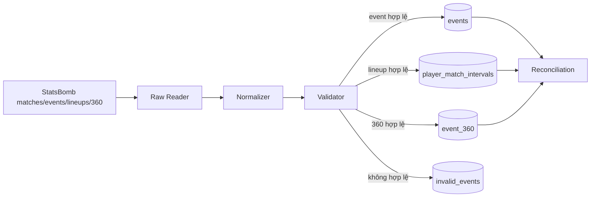

# MatchMind AI

> Biến StatsBomb event và 360 data thành SPADL actions, định giá từng hành động bằng VAEP và giúp scout tìm ra những đóng góp mà thống kê truyền thống bỏ sót.

MatchMind AI là một dự án player scouting analytics sử dụng dữ liệu sự kiện để trả lời những câu hỏi như:

- Cầu thủ nào tạo ra nhiều giá trị nhất trên mỗi 90 phút?
- Giá trị đó đến từ tấn công, phòng ngự hay một loại hành động cụ thể?
- Cầu thủ tạo hoặc làm mất giá trị ở khu vực nào trên sân?
- Hai cầu thủ cùng vị trí khác nhau như thế nào khi đặt trong cùng một bộ lọc?

Dự án không bắt đầu từ chatbot. Nền tảng của MatchMind là dữ liệu có thể kiểm chứng, chuỗi hành động SPADL-style và kết quả VAEP tái lập được. Lớp AI về sau chỉ giải thích những kết quả đã được hệ thống tính toán.

## Trạng thái hiện tại

| Plan | Mục tiêu | Trạng thái |
|---|---|---|
| [01 — Product Scope](plans/01-product-scope.md) | Xác định người dùng, giá trị và phạm vi MVP | Hoàn thành |
| [02 — Data Foundation](plans/02-data-foundation.md) | Enriched StatsBomb events, lineup intervals và 360 trong PostgreSQL | Hoàn thành |
| [03 — SPADL Actions & State Features](plans/03-analytics-features.md) | Chuyển event thành action và feature theo từng trạng thái | Bước tiếp theo |
| [04 — VAEP Modeling](plans/04-vaep-modeling.md) | Train `P_score`/`P_concede`, định giá action và tính VAEP/90 | Đã lên kế hoạch |

## Sản phẩm hướng tới

MatchMind hướng tới scout và recruitment analyst cần đánh giá cầu thủ qua nhiều trận. Analyst và người hâm mộ nâng cao là nhóm người dùng phụ.

Thay vì chỉ nhìn vào bàn thắng, kiến tạo hoặc số lần chuyền thành công, MatchMind xem xét tác động của từng hành động như chuyền bóng, kéo bóng, tranh chấp, thu hồi và dứt điểm. Hệ thống đánh giá hành động đó giúp đội tiến gần hơn đến bàn thắng hay giảm nguy cơ thủng lưới, rồi tổng hợp thành điểm đóng góp của mỗi cầu thủ.

Nhờ đó, người dùng có thể tìm ra những cầu thủ đóng góp thầm lặng, hiểu điểm mạnh và điểm yếu của họ, so sánh các ứng viên cùng vị trí và kiểm tra lại những tình huống đã tạo nên kết quả. MatchMind hỗ trợ quá trình tuyển trạch, không thay thế đánh giá chuyên môn hoặc quyết định chuyển nhượng của con người.

MVP hiện chưa xử lý video, dữ liệu vị trí liên tục hoặc dữ liệu trực tiếp; sản phẩm cũng không dự báo cá cược hay tự động đưa ra quyết định chuyển nhượng.

## Tính năng của dự án

| Tính năng | Giá trị cho người dùng | Trạng thái |
|---|---|---|
| Chuẩn bị dữ liệu trận đấu | Tổng hợp và kiểm tra dữ liệu sự kiện, đội hình và thông tin không gian từ StatsBomb | Hoàn thành nền tảng |
| Định giá từng hành động | Cho biết một pha bóng tạo thêm hay làm mất giá trị cho đội | Bước phát triển tiếp theo |
| Bảng xếp hạng cầu thủ | Xếp hạng theo tổng đóng góp và mức đóng góp trên mỗi 90 phút | Đã lên kế hoạch |
| Phân tích tấn công và phòng ngự | Giúp nhận biết giá trị của cầu thủ đến từ mặt trận nào | Đã lên kế hoạch |
| So sánh cầu thủ | So sánh hai cầu thủ cùng vị trí trên một biểu đồ thống nhất | Đã lên kế hoạch |
| Bản đồ tạo giá trị | Hiển thị những khu vực cầu thủ thường tạo ra hoặc làm mất giá trị | Đã lên kế hoạch |
| Tìm kiếm và bộ lọc | Lọc theo giải đấu, vị trí, đội bóng, độ tuổi và số phút thi đấu | Đã lên kế hoạch |
| Kiểm chứng tình huống | Xem lại các hành động đóng góp tích cực hoặc tiêu cực nhất của cầu thủ | Đã lên kế hoạch |

Dataset hiện tại chỉ có World Cup 2022 nên bộ lọc giải đấu mới có một lựa chọn. Nguồn StatsBomb đang sử dụng không có ngày sinh; bộ lọc tuổi cần thêm một nguồn thông tin cầu thủ có giấy phép và được quản lý phiên bản riêng.

## Dataset

MatchMind hiện sử dụng bộ [StatsBomb Open Data](https://github.com/statsbomb/open-data) của FIFA World Cup 2022. Dataset được khóa bằng [manifest](datasets/statsbomb-world-cup-2022.yaml), bao gồm commit nguồn, phiên bản schema, phạm vi dữ liệu và checksum.

| Nội dung | Kết quả đã xác minh |
|---|---:|
| Trận đấu | 64 |
| Sự kiện | 234.637 |
| Loại sự kiện | 33 |
| Cú sút | 1.494 |
| Cú sút có xG | 1.494 |
| Source event ID trùng | 0 |

Toàn bộ `203.882` StatsBomb 360 frame của 64 trận đã được kiểm tra, liên kết với event bằng UUID và ingest vào PostgreSQL. Event-only vẫn là contract bắt buộc; 360 là enrichment tùy chọn cho feature nâng cao và không phải dữ liệu tracking liên tục. Việc sử dụng dữ liệu tuân theo giấy phép và yêu cầu attribution của StatsBomb.

## Data foundation đã xây dựng



Pipeline hiện có khả năng:

- Đọc dữ liệu match, lineup và event từ nguồn JSON bất biến.
- Mapping 33 loại event sang một canonical contract thống nhất.
- Giữ source event order, possession, subtype, body part, play pattern, pressure flags, related events và raw details.
- Chuẩn hóa tọa độ StatsBomb từ sân `120 × 80` về thang `0–100`.
- Lưu `2.958` player-match position intervals để tính phút thi đấu.
- Lưu và kiểm tra `203.882` StatsBomb 360 frame; trận không có 360 vẫn sử dụng được.
- Giữ đúng period, timestamp, phút bù giờ, hiệp phụ và luân lưu.
- Kiểm tra ID, kiểu dữ liệu, tọa độ, quan hệ team/player và quy định null.
- Lưu record lỗi cùng nguyên nhân vào `invalid_events`.
- Upsert theo `(source, source_event_id)` để chạy lại mà không tạo dữ liệu trùng.
- Ghi lịch sử mỗi lần chạy vào `ingestion_runs` và đối soát toàn bộ record.

Trạng thái dữ liệu sau khi ingest và enrichment đầy đủ:

```text
raw events      = 234637
rejected        = 0
events in DB    = 234637
lineup intervals= 2958
360 frames      = 203882
reconciled      = True
```

`accepted` và `deduplicated` là số liệu theo từng lần chạy nên thay đổi khi pipeline được chạy lại. Các số phía trên là trạng thái cuối trong database; khóa nguồn và cơ chế upsert bảo đảm không tạo event trùng.

## Canonical database

Các bảng PostgreSQL chính:

| Bảng | Vai trò |
|---|---|
| `matches` | Thông tin trận đấu và tỷ số |
| `teams` | Danh mục đội bóng |
| `players` | Danh mục cầu thủ |
| `events` | Event đã được chuẩn hóa và kiểm tra |
| `player_match_intervals` | Khoảng vị trí/thi đấu của cầu thủ theo trận |
| `event_360` | Visible area và freeze-frame liên kết theo event UUID |
| `invalid_events` | Record bị từ chối cùng lý do |
| `ingestion_runs` | Phiên bản, trạng thái và số liệu mỗi lần ingest |

Chi tiết mapping StatsBomb → canonical nằm trong [data dictionary](docs/statsbomb-data-dictionary.md). Schema nền tảng nằm trong [migration 001](migrations/001_data_foundation.up.sql), còn enrichment VAEP/360 nằm trong [migration 002](migrations/002_vaep_event_enrichment.up.sql).

## Chạy project

Yêu cầu: Python 3.12 và Docker Desktop.

### 1. Cài dependency

```powershell
py -3.12 -m pip install -r requirements.txt
```

### 2. Khởi động PostgreSQL và pgAdmin

```powershell
docker compose up -d
docker compose ps
```

- PostgreSQL: `localhost:5433`
- pgAdmin: [http://localhost:5050](http://localhost:5050)
- Có thể thay đổi cấu hình bằng các biến trong [.env.example](.env.example).

### 3. Tạo schema ở lần chạy đầu tiên

```powershell
Get-Content -Raw migrations/001_data_foundation.up.sql |
  docker compose exec -T postgres psql -v ON_ERROR_STOP=1 -U matchmind -d matchmind

Get-Content -Raw migrations/002_vaep_event_enrichment.up.sql |
  docker compose exec -T postgres psql -v ON_ERROR_STOP=1 -U matchmind -d matchmind
```

### 4. Kiểm tra dataset trước khi ingest

```powershell
py -3.12 scripts/profile_statsbomb.py --strict
```

`baseline: PASS` nghĩa là dữ liệu hiện tại vẫn khớp với manifest đã khóa.

### 5. Ingest toàn bộ 64 trận

```powershell
py -3.12 scripts/ingest_all.py
```

Có thể chạy lại lệnh này an toàn. Event đã tồn tại sẽ được nhận diện là deduplicated thay vì được chèn thêm.

### 6. Chạy test

```powershell
py -3.12 -m unittest discover -s tests -v
```

## Khám phá event nguồn

Xem từng trang 100 event của một trận:

```powershell
py -3.12 scripts/view_events.py 3857276
```

Chỉ xem các cú sút:

```powershell
py -3.12 scripts/view_events.py 3857276 --type Shot
```

Xem toàn bộ JSON của trang đầu:

```powershell
py -3.12 scripts/view_events.py 3857276 --raw --once
```

## SPADL và VAEP — các bước kế tiếp

Plan 03 sẽ chuyển enriched event thành chuỗi hành động SPADL-style với mỗi dòng đại diện cho:

```text
match × action
```

Mỗi state chứa action hiện tại, ba action trước và context có sẵn tại thời điểm đó: loại/kết quả, tọa độ, possession, tỷ số, thời gian và các feature 360 tùy chọn. Không feature nào được nhìn action tương lai.

Đầu ra chính là bảng/file `actions` và `action_features`. Plan 04 dùng chúng để train hai model XGBoost độc lập:

```text
P_score(state_i)   = P(đội thực hiện action ghi bàn trong 10 action tiếp theo)
P_concede(state_i) = P(đội thực hiện action thủng lưới trong 10 action tiếp theo)
```

Giá trị của action `a_i` được tính từ thay đổi xác suất trước và sau action:

```text
VAEP(a_i) = [P_score(after_i) - P_score(before_i)]
          + [P_concede(before_i) - P_concede(after_i)]
```

VAEP sau đó được cộng theo cầu thủ và chuẩn hóa trên 90 phút để tạo bảng xếp hạng scouting. StatsBomb 360 bổ sung context không gian khi có; action không có 360 vẫn được giữ trong baseline.

## Cấu trúc chính

```text
plans/                  Kế hoạch và tiêu chí hoàn thành
datasets/               Manifest khóa dataset
docs/                   Data dictionary
migrations/             PostgreSQL schema và rollback
open-data/              StatsBomb Open Data
scripts/                Công cụ profile, kiểm tra và ingest
src/matchmind/data/     Data pipeline
tests/                  Unit tests cho pipeline
reports/                Báo cáo profiling và pilot ingestion
```

---

MatchMind đang được xây dựng theo một nguyên tắc đơn giản: **phân tích hay chỉ có giá trị khi dữ liệu phía dưới đáng tin cậy**.
