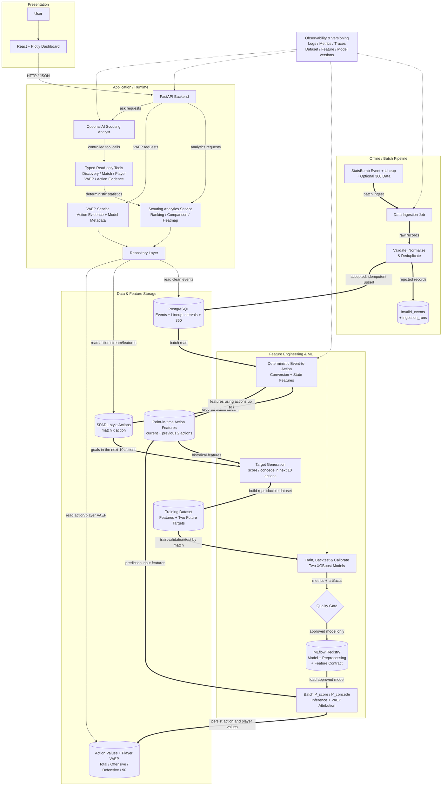

# MatchMind architecture

```mermaid
flowchart TB

    %% =====================================================
    %% OFFLINE / BATCH DATA PIPELINE
    %% =====================================================
    subgraph OFFLINE["Offline / Batch Pipeline"]
        A["StatsBomb Event + Lineup<br/>+ Optional 360 Data"]
        B["Data Ingestion Job"]
        C["Validate, Normalize<br/>& Deduplicate"]
        BAD[("invalid_events<br/>+ ingestion_runs")]

        A ==>|"batch ingest"| B
        B ==>|"raw records"| C
        C ==>|"rejected records"| BAD
    end

    %% =====================================================
    %% DATA AND FEATURE STORAGE
    %% =====================================================
    subgraph DATA["Data & Feature Storage"]
        D[("PostgreSQL<br/>Events + Lineup Intervals + 360")]
        ACT[("SPADL-style Actions<br/>match x action")]
        FS[("Point-in-time Action Features<br/>current + previous 2 actions")]
        TD[("Training Dataset<br/>Features + Two Future Targets")]
        VALUES[("Action Values + Player VAEP<br/>Total / Offensive / Defensive / 90")]
    end

    C ==>|"accepted, idempotent upsert"| D

    %% =====================================================
    %% FEATURE ENGINEERING AND MACHINE LEARNING
    %% =====================================================
    subgraph ML["Feature Engineering & ML"]
        E["Deterministic Event-to-Action<br/>Conversion + State Features"]
        TARGET["Target Generation<br/>score / concede in next 10 actions"]
        H["Train, Backtest & Calibrate<br/>Two XGBoost Models"]
        Q{"Quality Gate"}
        I[("MLflow Registry<br/>Model + Preprocessing<br/>+ Feature Contract")]
        J["Batch P_score / P_concede<br/>Inference + VAEP Attribution"]
    end

    D ==>|"batch read"| E
    E ==>|"ordered action stream"| ACT
    E ==>|"features using actions up to i"| FS

    FS ==>|"historical features"| TARGET
    ACT ==>|"goals in the next 10 actions"| TARGET
    TARGET ==>|"build reproducible dataset"| TD

    TD ==>|"train/validation/test by match"| H
    H ==>|"metrics + artifacts"| Q
    Q ==>|"approved model only"| I

    %% Inference needs BOTH the trained model and match features.
    I ==>|"load approved model"| J
    FS ==>|"prediction input features"| J
    J ==>|"persist action and player values"| VALUES

    %% =====================================================
    %% APPLICATION / RUNTIME
    %% =====================================================
    subgraph APP["Application / Runtime"]
        L["FastAPI Backend"]

        G["Scouting Analytics Service<br/>Ranking / Comparison / Heatmap"]
        PS["VAEP Service<br/>Action Evidence + Model Metadata"]

        K["Optional AI Scouting Analyst"]
        T["Typed Read-only Tools<br/>Discovery / Match / Player<br/>VAEP / Action Evidence"]
        R["Repository Layer"]

        L -->|"analytics requests"| G
        L -->|"VAEP requests"| PS
        L -->|"ask requests"| K

        K -->|"controlled tool calls"| T
        T -->|"deterministic statistics"| G

        G --> R
        PS --> R
    end

    R -->|"read clean events"| D
    R -->|"read action stream/features"| ACT
    R -->|"read action/player VAEP"| VALUES

    %% =====================================================
    %% PRESENTATION
    %% =====================================================
    subgraph UI["Presentation"]
        U["User"]
        M["React + Plotly Dashboard"]

        U --> M
        M -->|"HTTP / JSON"| L
    end

    %% =====================================================
    %% CROSS-CUTTING QUALITY
    %% =====================================================
    O["Observability & Versioning<br/>Logs / Metrics / Traces<br/>Dataset / Feature / Model versions"]

    O -.-> B
    O -.-> E
    O -.-> H
    O -.-> L
    O -.-> K

    %% Legend:
    %% -->  runtime request/read dependency
    %% ==>  batch data/model flow
    %% -.-> cross-cutting concern
```
